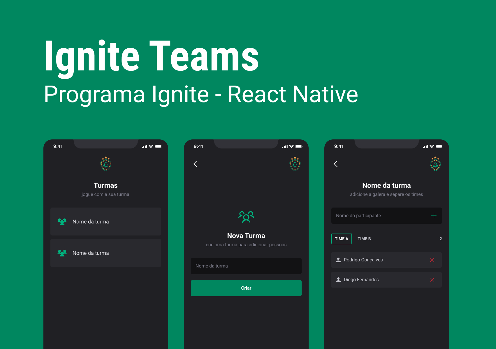
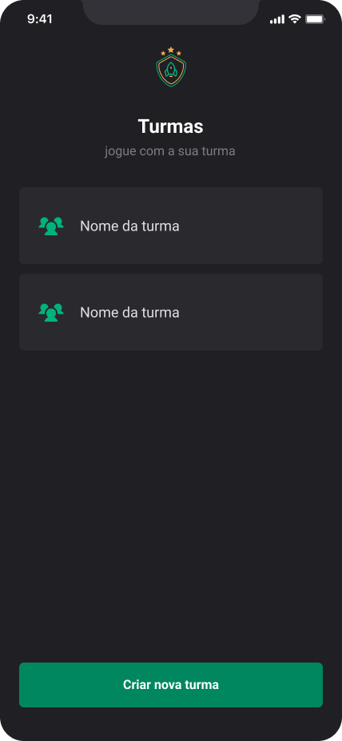
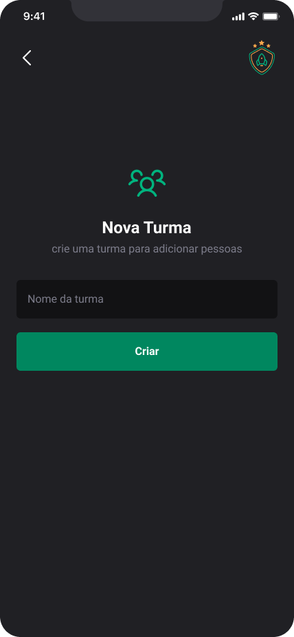
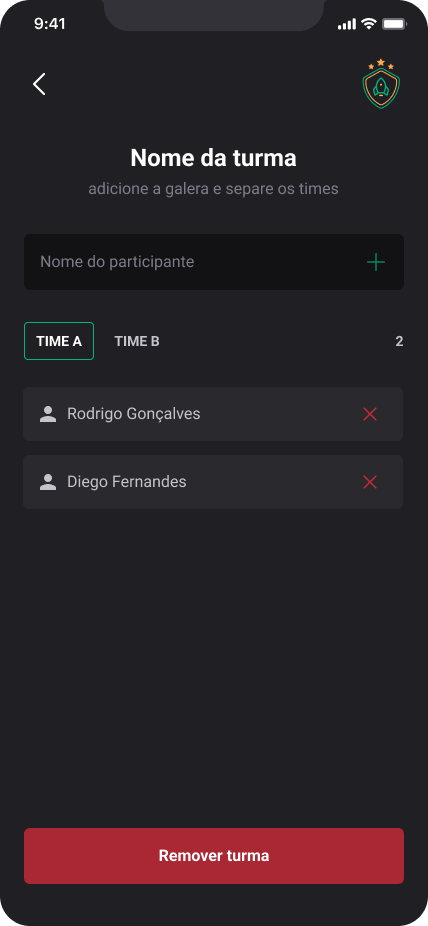

<h1 align="center">
  
  &nbsp;
  Ignite Teams
</h1>

<p align="center">
  

  

  
  
  <a href="https://github.com/pabloxt14/ignite-teams/commits/master">
    
  </a>
    
   

   <a href="https://github.com/pabloxt14/ignite-teams/stargazers">
    
  </a>
</p>

<p>
  
</p>

<h4 align="center"> 
  🚀 Aplicação em Finalizada 🚀
</h4>

<p align="center">
 <a href="#-about">About</a> | 
 <a href="#-layout">Layout</a> | 
 <a href="#-setup">Setup</a> | 
 <a href="#-technologies">Technologies</a> | 
 <a href="#-license">License</a>
</p>


## 💻 About

O **Ignite Teams** é uma aplicação que tem como proposta ajudar a organizar pessoas que se reúnem para jogar em turmas. Nesta é possível cadastrar e remover turmas, assim como cadastrar e remover membros do time e armazenar essas informações no armazenamento local do aparelho, preservando os dados mesmo que o app seja fechado.

Todavia, vale ressaltar que esse projeto é um dos desafios da trilha de `React Native` da escola de tecnologia [Rocketseat](https://www.rocketseat.com.br/).


<!-- ## 🔗 Deploy

O deploy da aplicação pode ser acessada através da seguinte URL base: https://pabloxt14-nlw-expert-notes.vercel.app/ -->


## 🎨 Layout

Você pode visualizar o layout do projeto através [desse link](https://www.figma.com/community/file/1151864427495057381). É necessário ter conta no [Figma](https://www.figma.com/) para acessá-lo.

A seguir, veja uma demonstração das principais telas da aplicação:

### Turmas

<p align="center">
  
</p>

### Nova turma

<p align="center">
  
</p>

### Times

<p align="center">
  
</p>

## ⚙ Setup

### 📝 Requisites

Antes de baixar o projeto você vai precisar ter instalado na sua máquina as seguintes ferramentas:

* [Git](https://git-scm.com)
* [NodeJS](https://nodejs.org/en/)
* [NPM](https://www.npmjs.com/) ou [Yarn](https://yarnpkg.com/) 

Além disto é bom ter um editor para trabalhar com o código como [VSCode](https://code.visualstudio.com/)

### Cloning and Running

Passo a passo para clonar e executar a aplicação na sua máquina:

```bash
# Clone este repositório
$ git clone https://github.com/PabloXT14/ignite-teams.git

# Acesse a pasta do projeto no terminal
$ cd ignite-teams

# Instale as dependências
$ npm install

# Execute o projeto em modo de desenvolvimento
$ npm run start

# A aplicação inciará em algum aparelho ou emulador na máquina.
```


## 🛠 Technologies

As seguintes principais ferramentas foram usadas na construção do projeto:

- **[React Native + Expo](https://vitejs.dev/)**
- **[TypeScript](https://www.typescriptlang.org/)**
- **[phosphor-react-native](https://github.com/duongdev/phosphor-react-native#readme)**
- **[@expo-google-fonts](https://docs.expo.dev/develop/user-interface/fonts/#with-usefonts-hook-1)**
- **[React Navigation](https://reactnavigation.org/)**
- **[Styled Components](https://styled-components.com/docs/basics#react-native)**

> Para mais detalhes das dependências gerais da aplicação veja o arquivo [package.json](./package.json)


## 📝 License

Este projeto está sob a licença MIT. Consulte o arquivo [LICENSE](./LICENSE) para mais informações

<p align="center">
  Feito com 💜 por Pablo Alan 👋🏽 <a href="https://www.linkedin.com/in/pabloalan/" target="_blank">Entre em contato!</a>  
</p>
